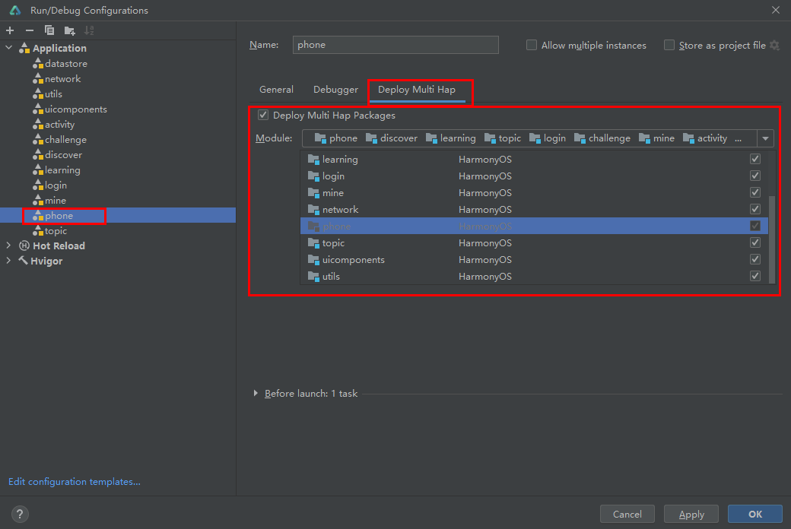

# HMOS世界

### 简介

基于分层架构和模块化设计的最佳实践，结合HarmonyOS“一次开发，多端部署”的能力，实现一个HarmonyOS赋能应用。

### 架构

#### 分层架构设计

HarmonyOS的分层架构主要包括三个层次：产品定制层、基础特性层和公共能力层。

本应用在产品定制层满足了不同设备类型的个性化需求。 基础特性层提供了登录、我的、学习和发现等核心功能模块，为各设备提供通用的功能支持。 公共能力层则提供了一套基础的开发组件和服务，包括公共UI组件、数据存储、网络和工具库，为应用开发提供了基础设施支持。
详见[最佳实践-分层架构设计](https://developer.harmonyos.com/cn/docs/documentation/doc-guides-V2/layered-architecture-design-0000001725966009-V2)。

#### 模块化设计

在HarmonyOS中，模块化不仅是一个设计原则，更是一种开发实践。它旨在将应用程序拆分为多个功能模块，每个功能模块负责特定的功能或特性。功能模块可以独立开发、编译和部署，也可以在不同的设备上灵活组合和调用，实现真正的多端协同。

本应用展现了HarmonyOS模块化设计的优势和实践方法。详见[最佳实践-模块化设计](https://developer.harmonyos.com/cn/docs/documentation/doc-guides-V2/modular-design-0000001678046862-V2)。

### 一次开发多端部署

本应用使用自适应布局和栅格布局等响应式布局方式，实现一套代码同时适配手机、折叠屏、平板等多种设备的能力。

### 性能

- 使用MVVM的设计模式，以实现更好的状态管理，减少应用的性能问题。详见[状态管理最佳实践](https://developer.harmonyos.com/cn/docs/documentation/doc-guides-V2/status-management-overview-0000001788679293-V2)。
- 本应用中采用了属性动画、路径动画、粒子动画、lottie动画等方式实现了多种动画效果。详见[动画实践案例](https://developer.harmonyos.com/cn/docs/documentation/doc-guides-V2/animation-practice-cases-0000001738587734-V2)。
- 本应用使用Navigation进行界面跳转，并使用了多种界面转场动画。详见[合理使用界面间转场](https://developer.harmonyos.com/cn/docs/documentation/doc-guides-V2/scenario-case-0000001714996773-V2)
- 使用懒加载和组件复用等方式提升长列表加载性能。详见[长列表加载性能优化](https://developer.harmonyos.com/cn/docs/documentation/doc-guides-V2/best-practices-long-list-introduction-0000001701060321-V2)。
- 本应用开发过程中，使用Frame分析、定位、解决卡顿问题。详见[滑动卡顿分析](https://developer.harmonyos.com/cn/docs/documentation/doc-guides-V2/frame-freezing-analysis-0000001665537514-V2)。

### 安全 

为增强用户对于个人数据隐私保护的控制和知情权，本应用添加了用户隐私说明弹窗，首次启动获得用户同意后，应用才能开始正常使用。详见[隐私保护最佳实践](https://developer.harmonyos.com/cn/docs/documentation/doc-guides-V2/privacy-protection-practice-0000001784690417-V2)。

### 注意

运行时需设置引用所有HSP模块。点击Run > Edit Configurations，选择Deploy Multi Hap标签页，勾选Deploy Multi Hap Packages， 选择使用方模块（phone）和所有HSP模块，点击OK。单击Run > Run “模块名称”（如Run ”entry“）或来启动应用/服务的编译构建。
