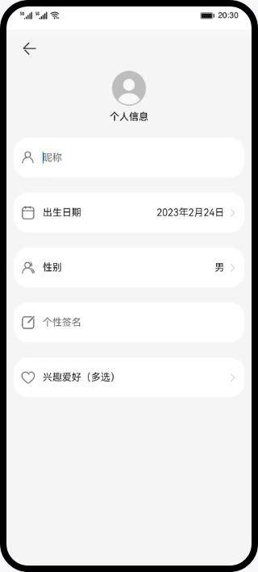

# 构建多种样式弹窗（ArkTS）

### 简介
本篇Codelab将介绍如何使用弹窗功能，实现四种类型弹窗。分别是：警告弹窗、自定义弹窗、日期滑动选择器弹窗、文本滑动选择器弹窗。

### 相关概念
- [警告弹窗](https://developer.harmonyos.com/cn/docs/documentation/doc-references-V3/ts-methods-alert-dialog-box-0000001478341185-V3?catalogVersion=V3) ：显示警告弹窗组件，可设置文本内容与响应回调。

- [自定义弹窗](https://developer.harmonyos.com/cn/docs/documentation/doc-references-V3/ts-methods-custom-dialog-box-0000001477981237-V3?catalogVersion=V3) ： 通过CustomDialogController类显示自定义弹窗。

- [日期滑动选择器弹窗](https://developer.harmonyos.com/cn/docs/documentation/doc-references-V3/ts-methods-datepicker-dialog-0000001427902500-V3?catalogVersion=V3) ：根据指定范围的Date创建可以选择日期的滑动选择器，展示在弹窗上。

- [文本滑动选择器弹窗](https://developer.harmonyos.com/cn/docs/documentation/doc-references-V3/ts-methods-textpicker-dialog-0000001427584912-V3?catalogVersion=V3) ：根据指定的选择范围创建文本选择器，展示在弹窗上。

### 相关权限

不涉及

### 使用说明

1. 打开应用首页，点击主页左上角返回按钮，展示警告弹窗，点击确定按钮退出页面。
2. 打开应用首页，点击出生日期选项，展示日期滑动选择弹窗，上下滑动日期，点击确定按钮，显示选中日期。
3. 打开应用首页，点击性别选项，展示文本滑动选择弹窗，上下滑动文本，点击确定按钮，显示选中文本。
4. 打开应用首页，点击兴趣爱好选项，展示自定义弹窗，选中多个兴趣爱好，点击确定，显示选中兴趣爱好。

### 约束与限制

1. 本示例仅支持标准系统上运行，支持设备：华为手机或运行在DevEco Studio上的华为手机设备模拟器。
2. 本示例为Stage模型，支持API version 9。
3. 本示例需要使用DevEco Studio 3.1 Release版本进行编译运行。