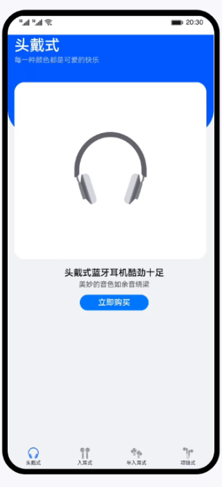

# toolbar、toolbar-item组件的使用（JS）
### 简介
兼容JS的类Web开发范式的方舟开发框架，采用经典的HML、CSS、JavaScript三段式开发方式。此种开发方式，更接近Web前端开发者的使用习惯。本篇Codelab将引导开发者基于此种开发方式，使用toolbar和toolbar-item组件实现一个简单的底部导航应用。效果如图所示：

### 相关概念 

-   [toolbar组件](https://developer.harmonyos.com/cn/docs/documentation/doc-references-V3/js-components-basic-toolbar-0000001427902532-V3?catalogVersion=V3)：工具栏。放在界面底部，用于展示针对当前界面的操作选项。
-   [toolbar-item组件](https://developer.harmonyos.com/cn/docs/documentation/doc-references-V3/js-components-basic-toolbar-item-0000001428061812-V3?catalogVersion=V3)：工具栏子组件。作为工具栏子组件，用于展示工具栏上的一个操作选项。
-   [自定义组件](https://developer.harmonyos.com/cn/docs/documentation/doc-references-V3/js-components-custom-basic-usage-0000001477981289-V3?catalogVersion=V3)：用户可根据业务需求将已有的组件进行扩展，增加自定义的私有属性和事件，封装成新的组件，方便在工程中多次调用，提高页面布局代码的可读性。

### 相关权限

不涉及

### 使用说明
1. 点击底部导航栏，切换展示不同内容。

### 约束与限制
1. 本示例仅支持标准系统上运行，支持设备：华为手机或运行在DevEco Studio上的华为手机设备模拟器。
2. 本示例为FA模型，支持API version 9。
3. 本示例需要使用DevEco Studio 3.1 Release版本进行编译运行。